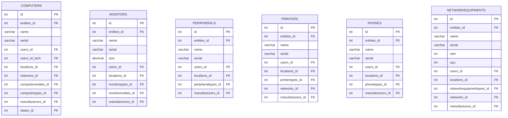
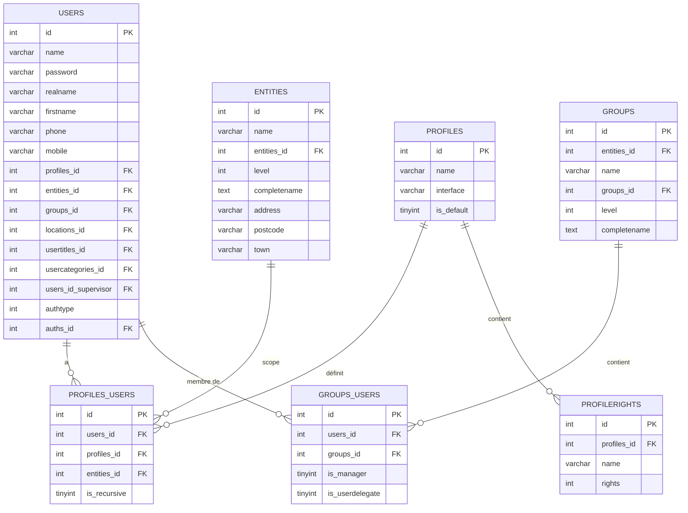
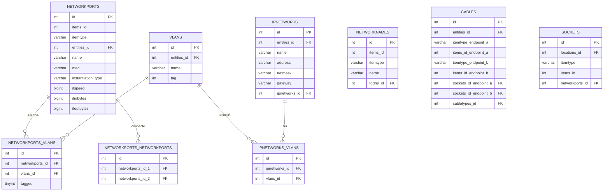
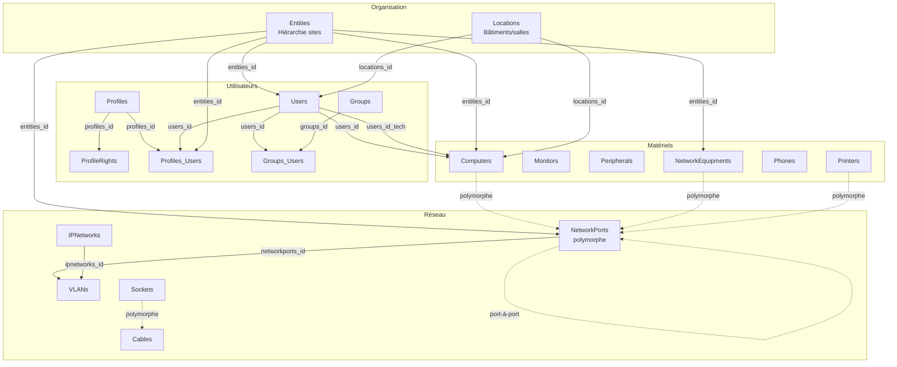

# Reverse Engineering — BDD GLPI

> Source : [glpi-empty.sql](https://github.com/glpi-project/glpi/blob/main/install/mysql/glpi-empty.sql) (MySQL/MariaDB, +250 tables)

## 1. Architecture générale de GLPI

| Aspect | Détail |
|---|---|
| **SGBD** | MySQL / MariaDB, InnoDB, `utf8mb4_unicode_ci` |
| **Tables** | +250, préfixées `glpi_` |
| **PK** | `id INT UNSIGNED AUTO_INCREMENT` sur chaque table |
| **FK** | Pattern `<table>_id` (ex: `computers_id`), **pas de contraintes FK explicites** |
| **Polymorphisme** | Champs `itemtype` (VARCHAR) + `items_id` (INT) pour les relations flexibles |
| **Multi-entités** | Colonne `entities_id` + `is_recursive` sur la majorité des tables |
| **Soft delete** | Colonne `is_deleted` (TINYINT) |
| **Templates** | Colonnes `is_template` + `template_name` |
| **Audit** | `date_mod`, `date_creation` sur presque toutes les tables |

---

## 2. Tables identifiées dans le périmètre

### 2.1 Matériels informatiques

**Pattern commun** à tous les assets :
- `entities_id`, `is_recursive`, `is_deleted`, `is_template`, `is_dynamic`
- `users_id` (propriétaire), `users_id_tech` (technicien responsable)
- `locations_id`, `manufacturers_id`, `states_id`
- `serial`, `otherserial`, `uuid`, `date_mod`, `date_creation`

**Tables de types/modèles associées** (dropdown) :
- `glpi_computermodels`, `glpi_computertypes`
- `glpi_monitormodels`, `glpi_monitortypes`
- `glpi_peripheralmodels`, `glpi_peripheraltypes`
- `glpi_printermodels`, `glpi_printertypes`
- `glpi_phonemodels`, `glpi_phonetypes`
- `glpi_networkequipmentmodels`, `glpi_networkequipmenttypes`
- `glpi_manufacturers`, `glpi_states`, `glpi_networks`

**Tables de composants matériels** (devices) :
- `glpi_deviceprocessors`, `glpi_devicememories`, `glpi_deviceharddrives`, `glpi_devicenetworkcards`, `glpi_devicegraphiccards`, `glpi_devicemotherboards`, etc.
- Liaison polymorphe via `glpi_items_device<X>` (champs `itemtype` + `items_id`)

**Liaison assets ↔ assets** :
- `glpi_assets_assets_peripheralassets` (polymorphe : `itemtype_asset`, `items_id_asset`, `itemtype_peripheral`, `items_id_peripheral`)

---

### 2.2 Utilisateurs & droits d'accès

**Points clés** :
- **Profils** = ensemble de droits. Un utilisateur peut avoir **plusieurs profils** sur **différentes entités** via `glpi_profiles_users`
- **Droits** stockés dans `glpi_profilerights` : champ `name` (ex: `computer`, `printer`) + `rights` (bitmask)
- **Groupes** hiérarchiques (auto-référence `groups_id`) avec rôles multiples (`is_requester`, `is_assign`, etc.)
- **Entités** hiérarchiques (auto-référence `entities_id`) = unités organisationnelles (sites, services…)

---

### 2.3 Réseaux & infrastructure

**Points clés** :
- `glpi_networkports` est **polymorphe** (`itemtype` + `items_id`) → peut être lié à un Computer, NetworkEquipment, Printer, etc.
- Connexions port-à-port via `glpi_networkports_networkports`
- VLANs associés aux ports (`glpi_networkports_vlans`) et aux sous-réseaux IP (`glpi_ipnetworks_vlans`)
- Câblage physique via `glpi_cables` (polymorphe aux deux extrémités) et `glpi_sockets`
- Types de port spécialisés : `glpi_networkportethernets`, `glpi_networkportwifis`, `glpi_networkportfiberchannels`
- `glpi_ipnetworks` hiérarchique (auto-référence `ipnetworks_id`), stocke adresses en 4 octets séparés pour le calcul

---

## 3. Constats & problèmes identifiés

| # | Constat | Impact |
|---|---|---|
| 1 | **Aucune contrainte FOREIGN KEY** dans le schéma | L'intégrité référentielle n'est pas garantie par le SGBD |
| 2 | **Polymorphisme extensif** (`itemtype`/`items_id`) | Impossible de créer des FK classiques → JOIN complexes, pas d'intégrité |
| 3 | **Pas de tablespaces** ni de partitionnement | Pas d'optimisation du stockage multi-sites |
| 4 | **Pas de vues** définies | Les requêtes complexes sont répétées dans le code applicatif |
| 5 | **Pas de triggers/procédures/fonctions** SQL | Toute la logique métier est dans le code PHP |
| 6 | **Base monolithique** | Pas de distribution/réplication entre sites |
| 7 | **Tables de types très nombreuses et similaires** | Redondance structurelle (6 tables `*types`, 6 tables `*models`) |
| 8 | **Index nombreux mais sans analyse** | Pas d'évidence d'optimisation des plans d'exécution |
| 9 | **Colonnes `sons_cache`/`ancestors_cache`** | Cache de hiérarchie en JSON dans la BDD → dénormalisation |

---

## 4. Relations globales — Schéma résumé

---

## 5. Résumé des tables dans le périmètre (30 tables)

### Matériels (14 tables)
`glpi_computers`, `glpi_computermodels`, `glpi_computertypes`, `glpi_monitors`, `glpi_monitormodels`, `glpi_monitortypes`, `glpi_peripherals`, `glpi_peripheraltypes`, `glpi_printers`, `glpi_printertypes`, `glpi_phones`, `glpi_phonetypes`, `glpi_networkequipments`, `glpi_networkequipmenttypes`

### Utilisateurs & droits (8 tables)
`glpi_users`, `glpi_profiles`, `glpi_profilerights`, `glpi_profiles_users`, `glpi_groups`, `glpi_groups_users`, `glpi_usertitles`, `glpi_usercategories`

### Réseaux (12 tables)
`glpi_networkports`, `glpi_networkports_networkports`, `glpi_networkports_vlans`, `glpi_vlans`, `glpi_ipnetworks`, `glpi_ipnetworks_vlans`, `glpi_ipaddresses`, `glpi_networknames`, `glpi_fqdns`, `glpi_cables`, `glpi_sockets`, `glpi_networks`

### Transversales (4 tables)
`glpi_entities`, `glpi_locations`, `glpi_manufacturers`, `glpi_states`
