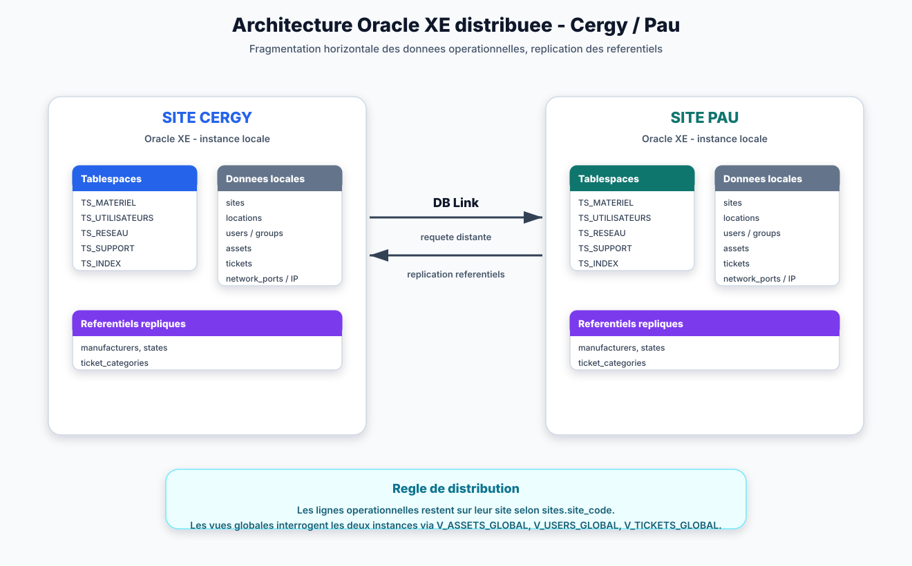
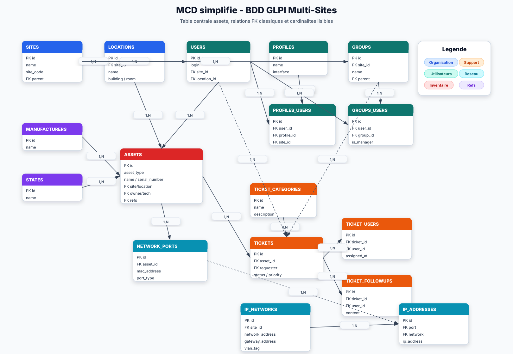
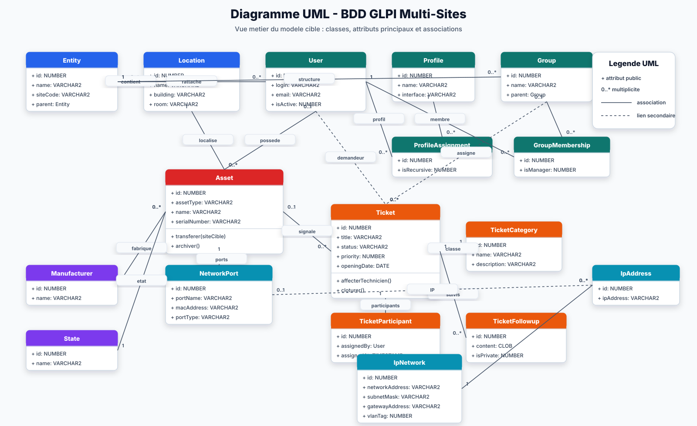

# Architecture - BDD GLPI Multi-Sites simplifiee

## 1. Vue d'ensemble

Le modele cible remplace le schema GLPI tres fragmente par une architecture Oracle distribuee entre deux sites, Cergy et Pau. La simplification principale consiste a centraliser tous les materiels dans une seule table `assets`.



Les schemas d'architecture et de MCD sont generes par `scripts/generate_diagrams.py`. Le diagramme UML est genere par `scripts/generate_uml_diagram.py`.

## 2. Principes retenus

| Ancien probleme | Choix simplifie |
|---|---|
| 6 tables de materiels presque identiques | 1 table `assets` avec `asset_type` |
| Colonnes polymorphes multiples dans tickets/ports | 1 FK simple `asset_id` |
| Trop de referentiels utilisateurs | Suppression de `user_titles`, `user_categories`, `profile_rights` |
| Reseau trop detaille pour le besoin projet | Conservation stricte des ports, sous-reseaux et IP |
| Audit utile mais non central | Tables systeme separees `audit_log`, `archives_materiel` |

## 3. MCD simplifie



## 3.1 Diagramme UML

Le diagramme UML reprend le meme perimetre que le MCD, mais sous forme de classes metier avec les attributs principaux, quelques operations significatives et les multiplicites d'association.



Pour regenerer les schemas apres une modification du modele :

```bash
python scripts/generate_diagrams.py
python scripts/generate_uml_diagram.py
```

## 4. MLD

### Transversal et referentiels

- `sites(id, parent_site_id -> sites, name, site_code, full_name, ...)`
- `locations(id, site_id -> sites, parent_location_id -> locations, name, building, room, ...)`
- `manufacturers(id, name)`
- `states(id, name)`

### Utilisateurs et droits

- `users(id, login, last_name, first_name, email, site_id -> sites, location_id -> locations, supervisor_user_id -> users, is_active, ...)`
- `profiles(id, name, interface, is_default)`
- `profiles_users(id, user_id -> users, profile_id -> profiles, site_id -> sites, is_recursive)`
- `groups(id, site_id -> sites, parent_group_id -> groups, name, full_name)`
- `groups_users(id, user_id -> users, group_id -> groups, is_manager)`

### Inventaire

- `assets(id, site_id -> sites, asset_type, name, serial_number, owner_user_id -> users, technician_user_id -> users, location_id -> locations, manufacturer_id -> manufacturers, state_id -> states, created_at, updated_at)`

La colonne `asset_type` porte le type fonctionnel : `COMPUTER`, `MONITOR`, `PERIPHERAL`, `PRINTER`, `PHONE`, `NETWORK_EQUIPMENT`.

### Support

- `ticket_categories(id, name, description)`
- `tickets(id, site_id -> sites, asset_id -> assets, requester_user_id -> users, assigned_group_id -> groups, category_id -> ticket_categories, status, priority, resolution, created_at, updated_at, assigned_at, resolved_at, closed_at)`
- `ticket_users(id, ticket_id -> tickets, user_id -> users, assigned_by_user_id -> users, assigned_at)`
- `ticket_followups(id, ticket_id -> tickets, user_id -> users, content, created_at)`

### Reseau

- `network_ports(id, site_id -> sites, asset_id -> assets, port_name, mac_address, port_type, created_at, updated_at)`
- `ip_networks(id, site_id -> sites, network_name, network_address, subnet_mask, gateway_address, vlan_name, vlan_tag)`
- `ip_addresses(id, site_id -> sites, network_port_id -> network_ports, ip_network_id -> ip_networks, ip_address, created_at, updated_at)`

### Systeme

- `audit_log(id, table_name, row_id, action, old_data, new_data, changed_by, changed_at)`
- `archives_materiel(id, original_table, original_id, archived_data, archived_by, archived_at)`

**Total : 19 tables**, dont 17 fonctionnelles et 2 systeme.

## 5. Strategie de distribution

| Donnees | Strategie |
|---|---|
| Assets, utilisateurs, tickets, ports reseau, sous-reseaux et IP | Fragmentation horizontale par `sites.site_code` |
| Referentiels | Replication via `SP_REPLIQUER_REFERENTIELS` |
| Reporting | Vues globales `V_ASSETS_GLOBAL`, `V_USERS_GLOBAL`, `V_STATS_GLOBAL`, `V_TICKETS_GLOBAL` |

## 6. Ordre d'execution

1. `01_tablespaces.sql`
2. `02_schema_tables.sql`
3. `04_clusters_indexes.sql`
4. `03_users_roles.sql`
5. `05_views.sql`
6. `06_plsql/triggers.sql`
7. `06_plsql/procedures.sql`
8. `06_plsql/functions.sql`
9. `06_plsql/cursors.sql`
10. `07_bddr.sql`
11. `08_query_plans.sql`
12. `09_test_data.sql`
13. `10_benchmark.sql`
